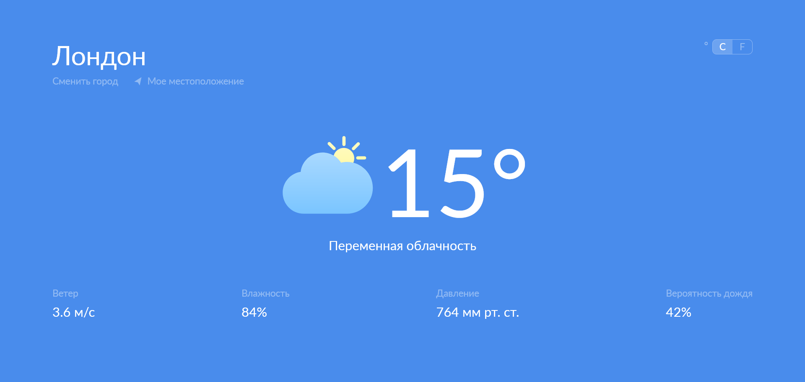

## Weather App

This is a simple weather app that provides weather information for a given location. It was created as a test project for a job interview.

## Features

- **Current Weather:** Get the current weather conditions for a specified location, including temperature, humidity, wind speed, and description.

## Demo

You can see a live demo of the Weather App [here](https://szheleshchenko.github.io/weather-app).

## Technologies Used

- React
- HTML
- CSS
- JavaScript (ES6+)
- [Weather API](https://openweathermap.org/api) for weather data
